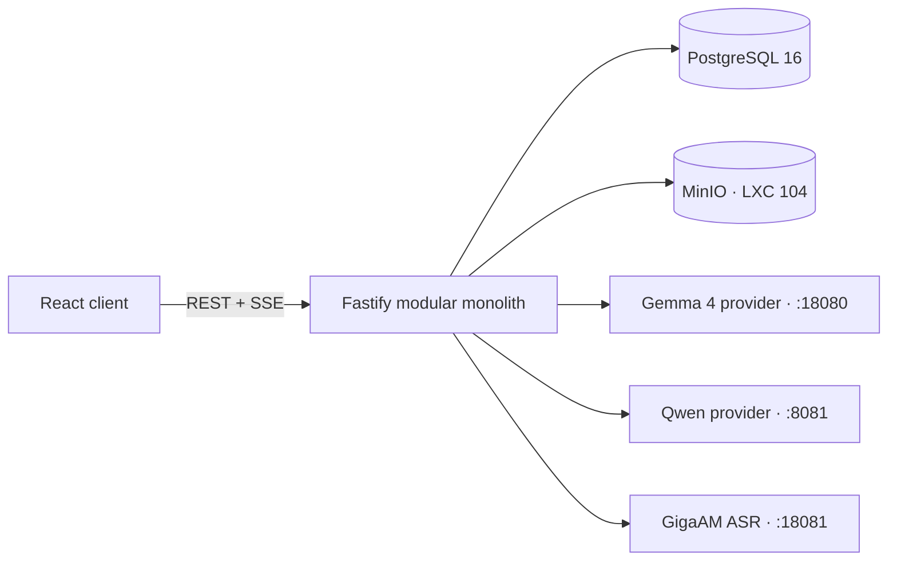

# Colibri Studio service architecture

`studio/` turns the browser-only LLM Studio bundle into a self-contained local
service. The C/C++ inference processes remain focused model providers. Fastify
owns application behavior, PostgreSQL owns durable structured state, and MinIO
owns binary objects.

## Boundaries

- `conversations`: conversation/message lifecycle and transactions;
- `engines`: provider registry, health and capability mapping;
- `chat`: prompt assembly, streaming, cancellation and final persistence;
- `attachments`: validation, MinIO objects and attachment metadata;
- `speech`: GigaAM transcription adapter;
- `settings`: durable workspace generation/UI settings;
- `legacy-import`: idempotent migration from the old localStorage payload;
- `platform`: PostgreSQL pool/migrations, S3 client, configuration and logging.

Each module exposes application ports. Infrastructure adapters implement these
ports and are wired only in the Fastify composition root. Route handlers do not
contain SQL, S3 calls, or provider-specific prompt conversion.

## Persistence

PostgreSQL stores workspaces, engines, settings, conversations, messages,
attachment metadata and import fingerprints. Message creation, attachment
binding and assistant placeholders are transactional. JSONB is limited to
provider metadata and evolving statistics; searchable domain fields remain
typed columns.

MinIO stores images, video, audio and source files in the private
`colibri-studio` bucket. Objects use workspace and attachment UUID prefixes;
their SHA-256 digest is stored beside the metadata for integrity checks and
future deduplication.
Fastify streams uploads/downloads and never exposes MinIO credentials to the
browser. The `ObjectStorage` port keeps MinIO replaceable with any S3-compatible
service.

## Compatibility and migration

The React client checks `llm-studio-conversations-v1` and
`llm-studio-settings-v2` once. If the workspace has not been imported, it sends
the old JSON payload to an idempotent import endpoint. A SHA-256 fingerprint
prevents duplicates. The old keys are retained as a rollback copy.

Nginx continues to expose the existing OpenAI-compatible routes for external
clients, while the new product API lives under `/api/v1`. HTTPS termination and
the microphone permission policy stay in Nginx; the React build is served by
Fastify so the application has one deployable service boundary.
